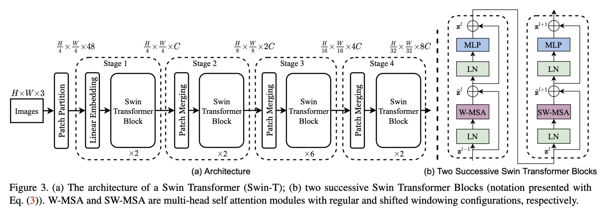

# Swin-Transformer-Tensorflow
A direct translation of the official PyTorch implementation of ["Swin Transformer: Hierarchical Vision Transformer using Shifted Windows"](https://arxiv.org/abs/2103.14030) to TensorFlow 2.

The official Pytorch implementation can be found [here](https://github.com/microsoft/Swin-Transformer).

## Introduction:


**Swin Transformer** (the name `Swin` stands for **S**hifted **win**dow) is initially described in [arxiv](https://arxiv.org/abs/2103.14030), which capably serves as a
general-purpose backbone for computer vision. It is basically a hierarchical Transformer whose representation is
computed with shifted windows. The shifted windowing scheme brings greater efficiency by limiting self-attention
computation to non-overlapping local windows while also allowing for cross-window connection.

Swin Transformer achieves strong performance on COCO object detection (`58.7 box AP` and `51.1 mask AP` on test-dev) and
ADE20K semantic segmentation (`53.5 mIoU` on val), surpassing previous models by a large margin.


## Usage:
### 1. Create a model with pretrained weights

`Swin-T`:

```python
from models.build import build_model

swin_transformer = build_model(config='configs/swin_tiny_patch4_window7_224.yaml', load_pretrained=True, weights_type='imagenet_1k')
```

`Swin-S`:

```python
from models.build import build_model

swin_transformer = build_model(config='configs/swin_small_patch4_window7_224.yaml', load_pretrained=True, weights_type='imagenet_1k')
```

`Swin-B`:

```python
from models.build import build_model

swin_transformer = build_model(config='configs/swin_base_patch4_window7_224.yaml', load_pretrained=True, weights_type='imagenet_1k')
```

The possible options for `model_name` and `weights_type` are:  

| model_name | weights_type | 22K model | 1K Model |
| :---: | :---: | :---: | :---: |
| swin_tiny_patch4_window7_224 | imagenet_1k | - | [github](https://github.com/VcampSoldiers/Swin-Transformer-Tensorflow/releases/download/v1.0/swin_tiny_patch4_window7_224_1k.tar.gz) |
| swin_small_patch4_window7_224 | imagenet_1k | - | [github](https://github.com/VcampSoldiers/Swin-Transformer-Tensorflow/releases/download/v1.0/swin_small_patch4_window7_224_1k.tar.gz) |
| swin_base_patch4_window7_224 | imagenet_1k | - | [github](https://github.com/VcampSoldiers/Swin-Transformer-Tensorflow/releases/download/v1.0/swin_base_patch4_window7_224_1k.tar.gz) |
| swin_base_patch4_window12_384 | imagenet_1k | - | [github](https://github.com/VcampSoldiers/Swin-Transformer-Tensorflow/releases/download/v1.0/swin_base_patch4_window12_384_1k.tar.gz) |
| swin_base_patch4_window7_224 | imagenet_22kto1k | - | [github](https://github.com/VcampSoldiers/Swin-Transformer-Tensorflow/releases/download/v1.0/swin_base_patch4_window7_224_22kto1k.tar.gz) |
| swin_base_patch4_window12_384 | imagenet_22kto1k | - | [github](https://github.com/VcampSoldiers/Swin-Transformer-Tensorflow/releases/download/v1.0/swin_base_patch4_window12_384_22kto1k.tar.gz) |
| swin_large_patch4_window7_224 | imagenet_22kto1k | - | [github](https://github.com/VcampSoldiers/Swin-Transformer-Tensorflow/releases/download/v1.0/swin_large_patch4_window7_224_22kto1k.tar.gz) |
| swin_large_patch4_window12_384 | imagenet_22kto1k | - | [github](https://github.com/VcampSoldiers/Swin-Transformer-Tensorflow/releases/download/v1.0/swin_large_patch4_window12_384_22kto1k.tar.gz) |
| swin_base_patch4_window7_224 | imagenet_22k | [github](https://github.com/VcampSoldiers/Swin-Transformer-Tensorflow/releases/download/v1.0/swin_base_patch4_window7_224_22k.tar.gz) | - |
| swin_base_patch4_window12_384 | imagenet_22k| [github](https://github.com/VcampSoldiers/Swin-Transformer-Tensorflow/releases/download/v1.0/swin_base_patch4_window12_384_22k.tar.gz) | - | 
| swin_large_patch4_window7_224 | imagenet_22k | [github](https://github.com/VcampSoldiers/Swin-Transformer-Tensorflow/releases/download/v1.0/swin_large_patch4_window7_224_22k.tar.gz) | - | 
| swin_large_patch4_window12_384 | imagenet_22k | [github](https://github.com/VcampSoldiers/Swin-Transformer-Tensorflow/releases/download/v1.0/swin_large_patch4_window12_384_22k.tar.gz) | - |


To create a custom classification model:
```python
import tensorflow as tf

from config import get_config
from models.build import build_model

custom_config = get_config(CUSTOM_ARGS, include_top=False)

swin_transformer = tf.keras.Sequential([
    build_model(config=custom_config, load_pretrained=True, weights_type='imagenet_1k'),
    tf.keras.layers.Dense(CUSTOM_NUM_CLASSES)
)
```
**Model ouputs are logits, so don't forget to include softmax in training/inference!!**

### 2. Load your own model configs
You can easily overwrite model configs with a custom YAML file:
```python
from config import get_config
from models.build import build_model_with_config

config = get_config(CUSTOM_YAML_FILE_PATH)
swin = build_model_with_config(config)
```
Predefined YAML files provided by Microsoft are located in the `configs` directory.

### 3. Convert PyTorch pretrained weights into Tensorflow checkpoints
We provide a python script with which we convert official PyTorch weights into Tensorflow checkpoints.
```bash
$ python3 convert_weights.py --cfg config_file --weights the_path_to_pytorch_weights --weights_type type_of_pretrained_weights --output the_path_to_output_tf_weights
```
## TODO:
- [x] Translate model code over to TensorFlow
- [x] Load PyTorch pretrained weights into TensorFlow model
- [ ] Write trainer code
- [ ] Reproduce results presented in paper
    - [ ] Object Detection
- [ ] Reproduce training efficiency of official code in TensorFlow

### Citations: 
```bibtex
@misc{liu2021swin,
      title={Swin Transformer: Hierarchical Vision Transformer using Shifted Windows}, 
      author={Ze Liu and Yutong Lin and Yue Cao and Han Hu and Yixuan Wei and Zheng Zhang and Stephen Lin and Baining Guo},
      year={2021},
      eprint={2103.14030},
      archivePrefix={arXiv},
      primaryClass={cs.CV}
}
```